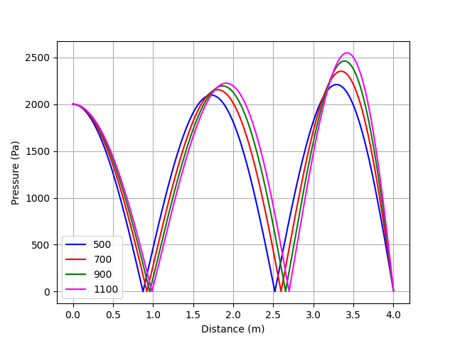
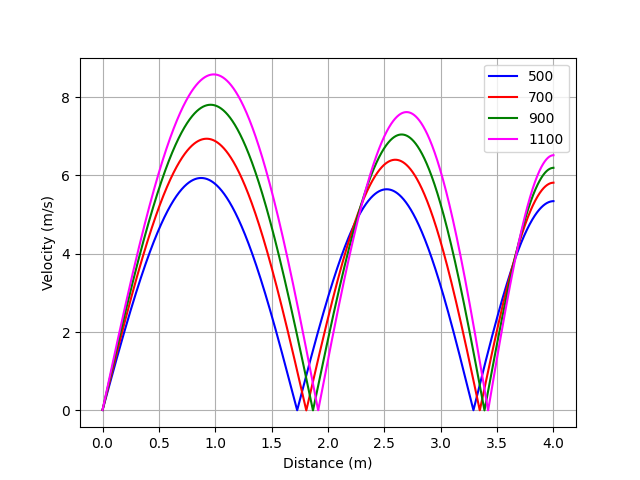

We present a numerical solution to the acoustic wave equation in a closed
duct using the Runge-Kutta method. The acoustic wave equation is a second-order partial
differential equation that describes the variation of pressure waves in a fluid medium. In
a closed duct, the acoustic wave equation governs the propagation of sound waves within
the duct and takes into account the reflection and absorption of waves at the duct walls.
The numerical solution of this equation provides valuable insights into the behavior of
sound waves in confined spaces and can be used to design and optimize duct systems for
controlling noise and other instabilities that may arise in the duct.
# Runge-Kutta Method
The Runge-Kutta method is a popular numerical method for solving differential equa-
tions that offers high accuracy and stability for a wide range of problems. This method
involves discretizing the differential equation into a set of algebraic equations, which are
then solved iteratively to obtain the numerical solution. In this paper, we propose a nu-
merical method based on the fourth-order Runge-Kutta scheme to solve the acoustic wave
equation in a closed duct. The accuracy of the proposed method is validated through a
comparison with analytical solutions and experimental data.

# Wave Equation

The gas is assumed to be perfect, inviscid, and non-heat-conducting.
Therefore, the one dimensional momentum, energy, and state equations
respectively can be expressed as:

$$\begin{gathered}
    \rho \frac{\partial u}{\partial t}+\rho u \frac{\partial u}{\partial x}+\frac{\partial p}{\partial x}=0 \\
    \frac{\partial \rho}{\partial t}+u \frac{\partial p}{\partial x}+\gamma p \frac{\partial u}{\partial x}=0 \\
     p=\rho R T
\end{gathered}$$

Using steady and time-dependent, small amplitude solutions to express
each dependent variable as a sum: $$\begin{aligned}
u & =\bar{u}(x)+u^{\prime}(x, t) \\
p & =\bar{p}(x)+p^{\prime}(x, t) \\
\rho & =\bar{\rho}(x)+\rho^{\prime}(x, t)
\end{aligned}$$ Assuming Mach number, $\mathrm{M}$ is much less than 0.1
, we get (1) to be:

$$\begin{gathered}
\rho \frac{\partial u}{\partial t}+\rho \frac{\partial u^{2}}{2 \partial x}+\frac{\partial p}{\partial x}=0 \\
\rho \frac{\partial u}{\partial t}+\rho \frac{\partial M^{2} a^{2}}{2 \partial x}+\frac{\partial p}{\partial x}=0 \\
\rho \frac{\partial u}{\partial t}+\frac{\partial p}{\partial x}=0
\end{gathered}$$

Now, using the above, and substituting equation (6) into the momentum
and energy equation, we get the acoustic, momentum and energy equations:

$$\begin{aligned}
& \frac{\partial u^{\prime}}{\partial t}+\frac{1}{\bar{\rho}} \frac{\partial p^{\prime}}{\partial x}=0 \\
& \frac{\partial p^{\prime}}{\partial t}+\gamma \bar{p} \frac{\partial u^{\prime}}{\partial x}=0
\end{aligned}$$

The wave equation with variable coefficients is obtained by
differentiating the momentum equation with respect to $\mathrm{x}$ and
the energy equation with respect to t, and by removing the
cross-derivative term:

$$\begin{gathered}
\frac{\partial^{2} p^{\prime}}{\partial x^{2}}-\frac{1}{\bar{\rho}} \frac{\partial \bar{\rho}}{\partial x} \frac{\partial p^{\prime}}{\partial x}-\frac{\bar{\rho}}{\gamma \bar{p}} \frac{\partial^{2} p^{\prime}}{\partial t^{2}}=0
\end{gathered}$$

Using the relation that $\mathrm{P}$ is constant:

$$\rho T=\text { constant }$$

Hence,

$$\begin{gathered}
\frac{1}{\bar{\rho}} \frac{\partial \bar{\rho}}{\partial x}+\frac{1}{\bar{T}} \frac{\partial \bar{T}}{\partial x}=0
\end{gathered}$$

Using this above equation:

$$\begin{gathered}
\frac{\partial^{2} p^{\prime}}{\partial x^{2}}+\frac{1}{\bar{T}} \frac{\partial \bar{T}}{\partial x} \frac{\partial p^{\prime}}{\partial x}-\frac{1}{\gamma R \bar{T}} \frac{\partial^{2} p^{\prime}}{\partial t^{2}}=0
\end{gathered}$$

Assuming periodic time dependence
$\left(p^{\prime}(x, t)=P^{\prime}(x) e^{i \omega t}\right)$, we get:

$$\begin{gathered}
\frac{\partial^{2} P^{\prime}}{\partial x^{2}}+\frac{1}{\bar{T}} \frac{\partial \bar{T}}{\partial x} \frac{\partial P^{\prime}}{\partial x}+\frac{\omega^{2}}{\gamma R T} P^{\prime}=0
\end{gathered}$$

The above obtained equation will be solved numerically to obtain the
pressure and velocity variations in the closed duct.

The resulting plots of the code are:

