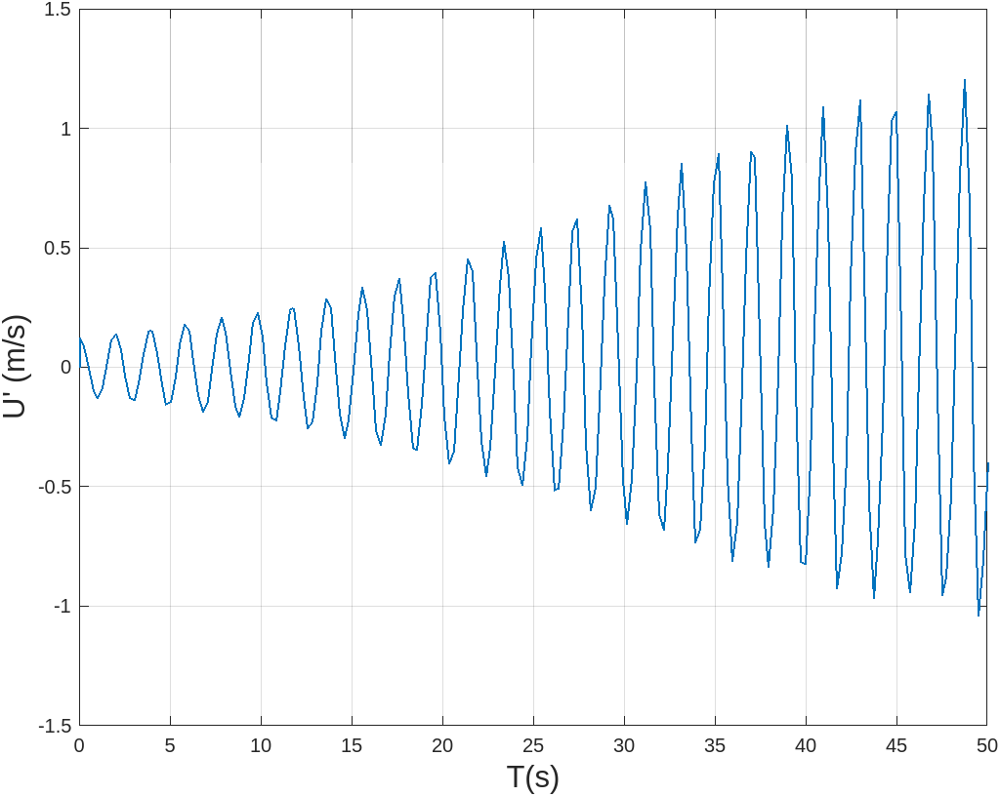
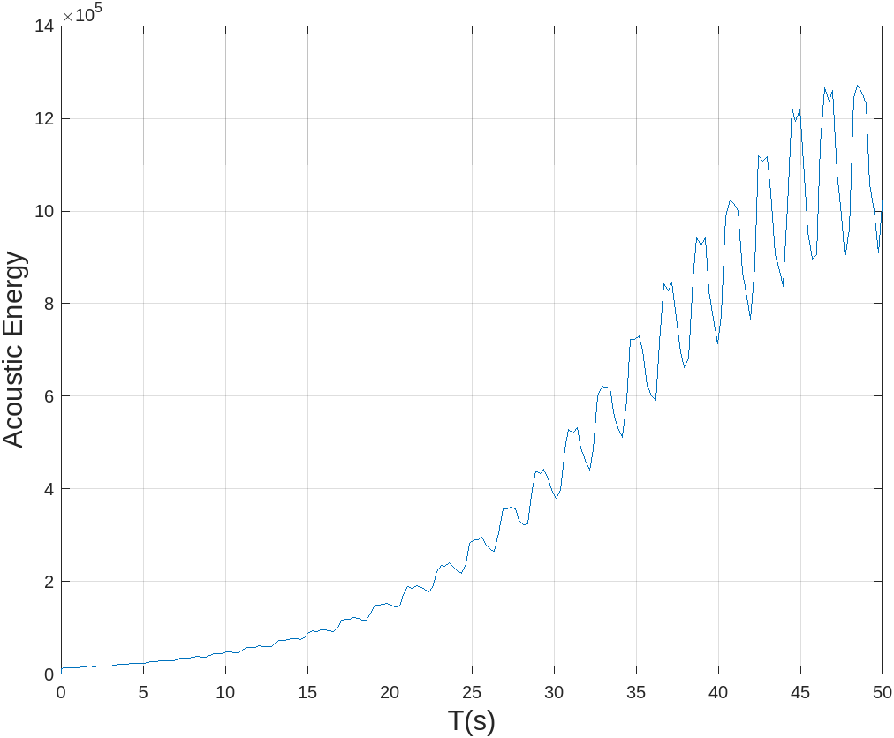
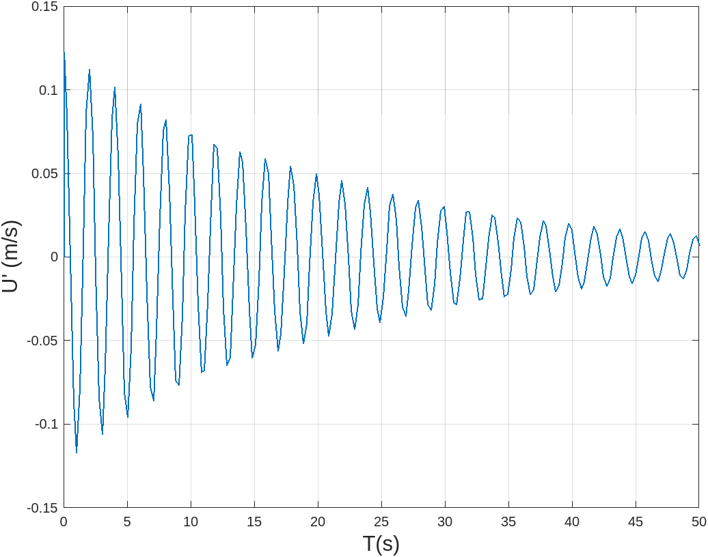
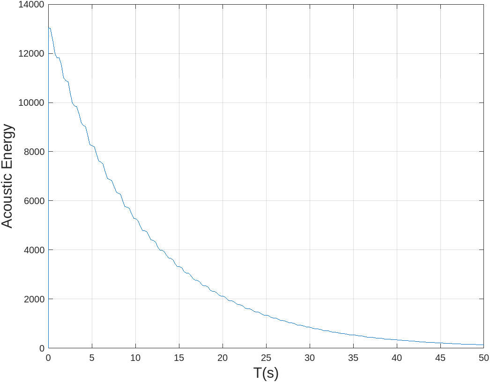
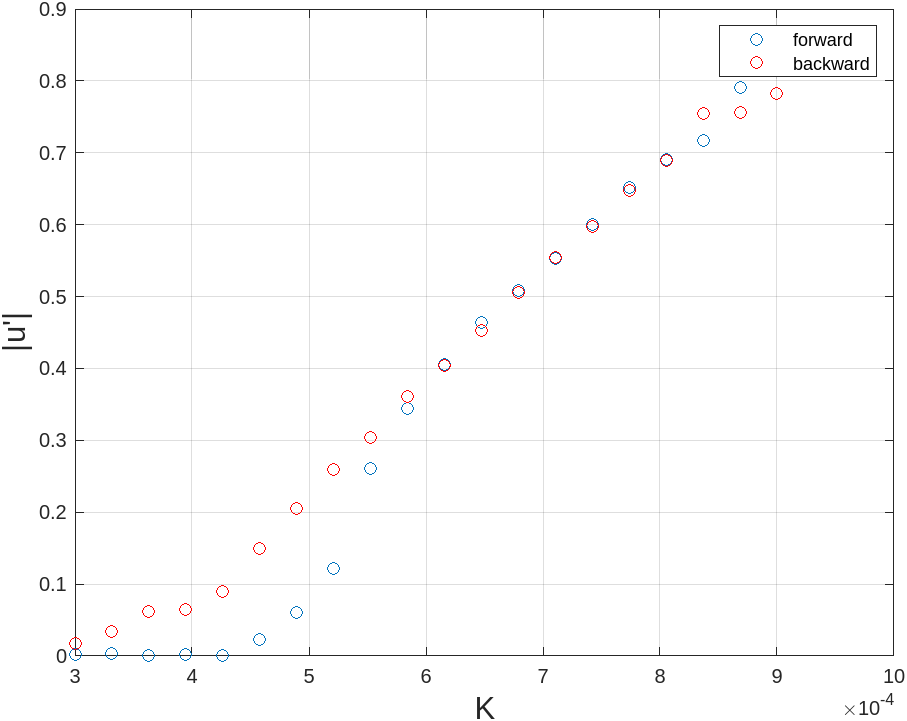

# Model for Rijke Tube

As presented in the paper by Balasubramaniam and Sujith, the model
involves neglecting the impact of mean flow and mean temperature
gradient within the duct, and deriving the governing equations for the
one-dimensional acoustic field.

$$\begin{aligned}
    \gamma M \frac{\partial u'}{\partial t} + \frac{\partial p'}{\partial x} &= 0 \\
    \frac{\partial p'}{\partial t} + \gamma M \frac{\partial u'}{\partial x} + \xi p' &= (\gamma - 1) \dot{Q}'(t) \delta(x-x_f)
\end{aligned}$$

These are non dimensional linearized momentum and energy equations
respectively. Here, $x = {\tilde{x}}/{l}$; $t = {c_0}/{l} \tilde{t}$;
$u' = {\tilde{u'}}/{u_0}$; $p' = {\tilde{p'}}/{\bar{p}}$;
$M = {u_0}/{c_0}$. $x$ is the distance along the axial direction, $l$ is
the length of the duct and $t$ is time. The steady state flow velocity,
pressure, temperature, are $u_0$, $\bar{p}$ and temperature $\bar{T}$,
and $u'$ and $p'$ are the acoustic velocity and pressure fluctuations.

Now we use the modified version(correction provided by Heckl) of the
King's law that quantifies the heat release from the heating wire
element given by
$$\dot{Q}'(t) = \frac{2L_w (T_w - \bar{T})}{S \sqrt{3}c_0 \bar{p}} \sqrt{\pi \lambda C_V u_0 \bar{\rho}l_c} \left [ \sqrt{\left | \frac{1}{3} + u_f'(t - \tau) \right|} - \sqrt{\frac{1}{3}} \right]$$

The energy equation by including the heat release rate term is given by:

$$\frac{\partial p'}{\partial t} + \gamma M \frac{\partial u'}{\partial x} + \xi p' = (\gamma - 1) \frac{2L_w (T_w - \bar{T})}{S \sqrt{3}c_0 \bar{p}} \sqrt{\pi \lambda C_V u_0 \bar{\rho}l_c} \left [ \sqrt{\left | \frac{1}{3} + u_f'(t - \tau) \right|} - \sqrt{\frac{1}{3}} \right] \delta(x-x_f)$$

Here, $\gamma$ is the heat capacity ratio, $L_w$ and $l_c$ refer to the
equivalent length and diameter of the wire, $(T_w - \bar{T})$ is the
temperature difference between the wire and the ambient temperature, $S$
is the cross-sectional area of the duct, $\lambda$, $C_{V}$, $u_0$ are
the heat conductivity, the specific heat of air at constant volume, and
the mean velocity of the air, respectively. $\tau$ is the time lag
accounting for the thermal inertia of the medium and $u_f$ is the
velocity fluctuations at the location of heater mesh. $\xi$ is the
damping coefficient.

Note that, quantities with tilde are dimensional and those without tilde
are non-dimensional.

To solve the equations we make use of the Galerkin Technique. It is a
powerful mathematical method commonly used in solving partial
differential equations. It involves representing the unknown variables,
in this case, the acoustic perturbations, as a series of basis
functions. These basis functions are typically chosen to be orthogonal
or satisfy certain orthogonality properties. By projecting the governing
equations onto these basis functions and applying the principle of
weighted residuals, we obtain a system of ordinary differential
equations that can be solved numerically. In the following expressions,
$k_j = j \pi$ is the non-dimensional wave number and $\omega_j = j\pi$
is the non-dimensional angular frequency of the $j^{th}$ duct mode.

$$\begin{aligned}
    u' = \sum_{j=1} ^{\infty} U_j(t) cos(k_j x)  \\
    p' =  \sum_{j=1} ^{\infty} \frac{\gamma M}{j \pi} P_j (t) sin(k_j x)
\end{aligned}$$

$$\dot{U_j} + k_j P_j = 0$$

$$\dot{P_j} + 2 \xi \omega_j P_j - k_j U_j = K \left [ \sqrt{\left | \frac{1}{3} + u_f'(t - \tau) \right|} - \sqrt{\frac{1}{3}} \right] \sin(x-x_f)$$
The heater power equation in the non-dimensional form from the above
expression is given by,
$$K = (\gamma - 1) \frac{4L_w (T_w - \bar{T})}{\gamma M S \sqrt{3}c_0 \bar{p}} \sqrt{\pi \lambda C_V u_0 \bar{\rho}l_c}$$
K is an important parameter, and is the main control parameter in the
following simulation.

Also, $\xi = 2 \omega_j \xi_j$ is the frequency dependent damping, where
$\xi_j$ is given by:
$$\xi_j = \frac{1}{2\pi} \left( c_1 \frac{\omega_j}{\omega_1} + c_2 \sqrt{\frac{\omega_1}{\omega_j}} \right)$$

The resulting plots of the code are:

